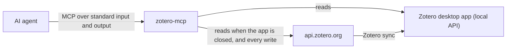

# zotero-mcp

[](https://github.com/Jayaram-Nambiar/zotero-mcp/actions/workflows/tests.yml)

[](LICENSE)

zotero-mcp connects AI agents such as Claude, ChatGPT and Codex, Cursor, GitHub Copilot, and Gemini CLI to your [Zotero](https://www.zotero.org/) library through the [Model Context Protocol](https://modelcontextprotocol.io/) (MCP). Once it is set up, you can ask an agent to:

- search your library and read item details, abstracts, and formatted references;
- list collections and page through their items;
- create, edit, tag, or delete items through the [Zotero Web API v3](https://www.zotero.org/support/dev/web_api/v3/basics);
- upload PDFs and other files as attachments;
- turn citation markers in a Word document into real Zotero citations that the [Zotero Word plugin](https://www.zotero.org/support/word_processor_plugin_usage) can refresh and restyle.

You set it up once: install one command, store your Zotero user ID and API key once, and point every agent at that command.

## Contents

- [How it works](#how-it-works)
- [Before you start](#before-you-start)
- [Step 1: Set up Zotero](#step-1-set-up-zotero)
- [Step 2: Store your user ID and API key](#step-2-store-your-user-id-and-api-key)
- [Step 3: Install zotero-mcp](#step-3-install-zotero-mcp)
- [Step 4: Connect your agents](#step-4-connect-your-agents)
- [Step 5: Check that it works](#step-5-check-that-it-works)
- [Use the tools](#use-the-tools)
- [Create Word citations](#create-word-citations)
- [Update, pin, or remove](#update-pin-or-remove)
- [Troubleshooting](#troubleshooting)
- [Security](#security)
- [Contributing](#contributing)

## How it works



- Each agent starts `zotero-mcp` by itself whenever it needs it and talks to it over standard input and output. You never run the server by hand, and it opens no network port.
- Reads go to the Zotero desktop app first, at `http://127.0.0.1:23119/api`. That is fast and works offline. If the app is closed, or its library has no items yet, reads use `https://api.zotero.org` instead. Writes always go to `api.zotero.org`, and Zotero syncs them back to the desktop app.
- The server needs two values from you: your numeric Zotero user ID and a Zotero API key. You store them once, as environment variables, in Step 2.

## Before you start

| You need | Notes |
| --- | --- |
| Windows, macOS, or Linux | Each step shows the commands for each system. |
| The [Zotero desktop app](https://www.zotero.org/download/), version 7 or later | Step 1 turns on the setting this server uses. |
| A [zotero.org account](https://www.zotero.org/user/register) | Needed for syncing and for the API key. |
| An AI agent that supports MCP | Claude Desktop, Claude Code, Cursor, VS Code with GitHub Copilot, GitHub Copilot CLI, the ChatGPT desktop app or Codex, Gemini CLI, Google Antigravity, opencode, Cline, Zed, or [another agent](#other-agents). |
| Git and uv | Step 3 installs them if you do not have them. |
| Microsoft Word with the Zotero Word plugin | Only for [Word citations](#create-word-citations). Step 1 shows how to install the plugin. |

**Running commands.** Several steps use a terminal:

- **Windows:** open **PowerShell**: press Start, type `PowerShell`, and press Enter.
- **macOS:** open **Terminal** from Applications → Utilities.
- **Linux:** open your terminal app.

Copy one code block at a time, paste it into the terminal, and press Enter. Text that starts with `YOUR_`, such as `YOUR_USER_ID`, is a placeholder: replace all of it with your own value. Example paths that contain `you`, such as `C:\Users\you\...`, stand for paths on your computer; Step 3 prints yours.

## Step 1: Set up Zotero

1. **Install Zotero.** Download it from [zotero.org/download](https://www.zotero.org/download/), install it, and open it.
2. **Sign in and sync.** Open Zotero's settings (**Edit → Settings** on Windows and Linux, **Zotero → Settings** on macOS), choose **Sync**, sign in with your zotero.org account, and let the library sync. If you have no account yet, create one at [zotero.org/user/register](https://www.zotero.org/user/register).
3. **Turn on the local API.** In the same settings window, choose **Advanced** and select **Allow other applications on this computer to communicate with Zotero**. The server then reads your library from the desktop app, quickly and without the internet.
4. **Create an API key.** Sign in at zotero.org and open [Create a new private key](https://www.zotero.org/settings/keys/new).
   - Enter a name you will recognize, such as `zotero-mcp`.
   - Under **Personal Library**, allow library access. Allow write access only if agents should be able to create, edit, upload, or delete items.
   - Save the key and copy it right away. Zotero shows it only once.
5. **Copy your user ID.** The [API keys page](https://www.zotero.org/settings/keys) shows your user ID for API calls. It is a number, not your username.
6. **Optional: install the Word plugin.** For Word citations, open Zotero's settings, choose **Cite → Word Processor Plugins**, and install the Microsoft Word add-in. Restart Word; a **Zotero** tab appears. [Installing the word processor plugin](https://www.zotero.org/support/word_processor_plugin_installation) has more detail.

Treat the API key like a password: it opens your library. Never paste it into a chat, an issue, a screenshot, or a file you share.

## Step 2: Store your user ID and API key

The server reads two environment variables:

| Variable | Value |
| --- | --- |
| `ZOTERO_USER_ID` | The user ID you copied in Step 1 |
| `ZOTERO_API_KEY` | The API key you created in Step 1 |

Store them once for your user account, and every agent can find them. On Windows, the key never has to be pasted into an agent's settings. On macOS and Linux, a few apps need the values in their own config; Step 4 says which. The server does not read `.env` files; [`.env.example`](.env.example) only lists the names.

### Windows

1. Open PowerShell.
2. Save your user ID. Replace `YOUR_USER_ID` with the number, and keep the quotation marks:

   ```powershell
   [Environment]::SetEnvironmentVariable("ZOTERO_USER_ID", "YOUR_USER_ID", "User")
   ```

3. Save your API key. This command asks for the key and hides it while you paste, so the key never appears on screen or in PowerShell's history. It is one long line; copy all of it:

   ```powershell
   $key = Read-Host "Paste your Zotero API key" -AsSecureString; [Environment]::SetEnvironmentVariable("ZOTERO_API_KEY", [System.Net.NetworkCredential]::new("", $key).Password, "User"); Remove-Variable key
   ```

4. Check both values. The first line prints your user ID; the second prints `True`:

   ```powershell
   [Environment]::GetEnvironmentVariable("ZOTERO_USER_ID", "User")
   [bool][Environment]::GetEnvironmentVariable("ZOTERO_API_KEY", "User")
   ```

Prefer a window to commands? Press Start, type `environment variables`, open **Edit environment variables for your account**, and add both variables under **User variables**.

On Windows, the server also reads these two variables directly from Windows whenever an agent does not pass them, or passes something that is not a user ID or key. They therefore work in every agent at once, including Claude Desktop and apps installed from the Microsoft Store, without restarting anything.

### macOS and Linux

Run steps 2 to 5 in the same terminal window.

1. Open a terminal.
2. Tell the next commands which startup file your shell reads. macOS uses zsh by default:

   ```bash
   RC=~/.zshrc
   ```

   Most Linux systems use bash:

   ```bash
   RC=~/.bashrc
   ```

   `echo $SHELL` shows your shell. If you use bash on macOS, run `RC=~/.bash_profile` instead.

3. Save your user ID. Replace `YOUR_USER_ID` with the number:

   ```bash
   echo 'export ZOTERO_USER_ID="YOUR_USER_ID"' >> "$RC"
   ```

4. Save your API key. This command asks for the key without showing it, so the key never appears on screen or in your shell history. It is one long line; copy all of it:

   ```bash
   printf "Paste your Zotero API key: "; read -rs key; echo; echo "export ZOTERO_API_KEY=\"$key\"" >> "$RC"; unset key
   ```

5. Load the new values and check them. The second line prints your user ID; the third prints `API key is set`:

   ```bash
   source "$RC"
   echo "$ZOTERO_USER_ID"
   [ -n "$ZOTERO_API_KEY" ] && echo "API key is set"
   ```

Agents started from a new terminal see these values. VS Code and Cursor see them too, because they read your shell's startup file even when you open them from the Dock or an application menu. Most other apps opened that way do not; Step 4 shows what to do for each agent.

## Step 3: Install zotero-mcp

### Install Git

uv downloads zotero-mcp from GitHub with Git. Check whether Git is installed:

```bash
git --version
```

If that prints a version number, continue with [Install uv](#install-uv). Otherwise, install Git:

| System | Command |
| --- | --- |
| Windows | `winget install --id Git.Git -e --source winget` |
| macOS | `xcode-select --install` (installs Apple's command line tools, which include Git) |
| Debian, Ubuntu | `sudo apt install git` |
| Fedora | `sudo dnf install git` |

Close the terminal, open a new one, and run `git --version` again.

### Install uv

[uv](https://docs.astral.sh/uv/) installs Python programs in their own environments, and downloads Python itself if needed. Check whether it is installed:

```bash
uv --version
```

If that does not print a version number, install uv.

Windows (PowerShell):

```powershell
powershell -ExecutionPolicy ByPass -c "irm https://astral.sh/uv/install.ps1 | iex"
```

macOS and Linux:

```bash
curl -LsSf https://astral.sh/uv/install.sh | sh
```

Close the terminal, open a new one, and run `uv --version` again. The [uv installation guide](https://docs.astral.sh/uv/getting-started/installation/) lists other ways to install it, such as WinGet and Homebrew.

### Install the server

```bash
uv tool install --python 3.12 --compile-bytecode git+https://github.com/Jayaram-Nambiar/zotero-mcp.git
```

`--python 3.12` and `--compile-bytecode` make the server start in a second or two. Some agents, Claude Code among them, give up on a server that takes longer to answer its first request, and with newer Python versions the first start can take several seconds.

The output includes `Installed 1 executable: zotero-mcp`. uv may then warn that its `bin` folder is not on your `PATH`; that is fine, because agents use the full path from the next step. Run `uv tool update-shell` only if you also want to type `zotero-mcp` in a terminal.

Check the installed version:

```bash
uv tool list
```

It lists `zotero-mcp v1.1.0` or newer.

### Copy the full path of the command

Agents start the server by its full path. Print it.

Windows (PowerShell):

```powershell
Join-Path (uv tool dir --bin) "zotero-mcp.exe"
```

This prints a path such as `C:\Users\you\.local\bin\zotero-mcp.exe`.

macOS and Linux:

```bash
echo "$(uv tool dir --bin)/zotero-mcp"
```

This prints a path such as `/Users/you/.local/bin/zotero-mcp`. Keep the path at hand for Step 4.

## Step 4: Connect your agents

Add the server to every agent you use, always under the name `zotero`. Set up only the agents you have; skip the rest.

Jump to your agent: [Claude Desktop](#claude-desktop) · [Claude Code](#claude-code) · [Cursor](#cursor) · [VS Code](#vs-code-with-github-copilot) · [GitHub Copilot CLI](#github-copilot-cli) · [ChatGPT and Codex](#chatgpt-desktop-app-and-codex) · [Gemini CLI](#gemini-cli) · [Antigravity](#google-antigravity) · [opencode](#opencode) · [Cline](#cline) · [Zed](#zed) · [other agents](#other-agents)

### Paths in config files

The examples write the command as `/path/to/zotero-mcp`. Replace it with the full path from Step 3, written for the kind of file you are editing:

| Where the path goes | Windows | macOS |
| --- | --- | --- |
| A terminal command | `"C:\Users\you\.local\bin\zotero-mcp.exe"` | `/Users/you/.local/bin/zotero-mcp` |
| A JSON file: double every backslash | `"C:\\Users\\you\\.local\\bin\\zotero-mcp.exe"` | `"/Users/you/.local/bin/zotero-mcp"` |
| A TOML file: use single quotes on Windows | `'C:\Users\you\.local\bin\zotero-mcp.exe'` | `"/Users/you/.local/bin/zotero-mcp"` |

On Linux, the path usually starts with `/home/you/` instead of `/Users/you/`.

### Edit a JSON config file safely

Most agents keep their servers in a JSON file, in a block named `mcpServers`; VS Code names the block `servers`, and opencode names it `mcp`. Each agent's section below gives the commands to open and to check its file. When you add `zotero`:

1. **The file is empty or new:** paste the agent's whole example.
2. **The file has other settings but no server block:** keep everything that is already there. Put a comma after the last setting, then paste the server block inside the outer braces:

   ```json
   {
     "preferences": {
       "example-setting": true
     },
     "mcpServers": {
       "zotero": {
         "command": "/path/to/zotero-mcp"
       }
     }
   }
   ```

3. **The file already has a server block:** add only the `"zotero": { ... }` entry inside it, with a comma after the entry before it:

   ```json
   {
     "mcpServers": {
       "other-server": {
         "command": "other-command"
       },
       "zotero": {
         "command": "/path/to/zotero-mcp"
       }
     }
   }
   ```

Paste the examples rather than typing them: some editors turn straight quotation marks into curly ones, which breaks JSON. After saving, run the agent's check command. If it reports an error, a comma, quotation mark, or brace is missing. If it says it cannot find the file, the path in the command is wrong, not the JSON.

### Your user ID and key in agent configs

- **Windows:** no agent needs the two values in its config. Whenever an agent does not pass them, the server reads them from your Windows user environment, where Step 2 stored them.
- **macOS and Linux:** the server can use only the values the agent passes to it. Some agents pass your shell's variables; others pass only a few, or none. Each agent's section below says which, and how to add the values to its config when they are needed. Where an agent can refer to a variable, such as `${env:ZOTERO_API_KEY}` in Cursor, use the reference rather than the key itself. Keep any file that holds the key itself private.

### Claude Desktop

Claude Desktop, the Claude chat app, reads this file:

| System | File |
| --- | --- |
| Windows | `%APPDATA%\Claude\claude_desktop_config.json` |
| macOS | `~/Library/Application Support/Claude/claude_desktop_config.json` |

> [!IMPORTANT]
> Quit Claude Desktop completely before you edit this file. Closing the window is not enough: Claude keeps running in the background and can save its own copy of the file over your change.

Claude can also show you the file: open its **Settings** from the Claude menu, choose **Developer**, and click **Edit Config**. Claude creates the file if it does not exist yet. Then quit Claude before you edit it.

1. Quit Claude Desktop.
   - **Windows:** right-click the Claude icon in the notification area at the right end of the taskbar (click **^** if the icon is hidden) and choose **Quit**.
   - **macOS:** choose **Claude → Quit Claude** in the menu bar, or press ⌘Q.
2. Open the file.

   Windows (PowerShell). If Notepad asks whether to create the file, choose **Yes**:

   ```powershell
   notepad "$env:APPDATA\Claude\claude_desktop_config.json"
   ```

   macOS (Terminal):

   ```bash
   mkdir -p "$HOME/Library/Application Support/Claude"
   touch "$HOME/Library/Application Support/Claude/claude_desktop_config.json"
   open -e "$HOME/Library/Application Support/Claude/claude_desktop_config.json"
   ```

3. Add the server, following [Edit a JSON config file safely](#edit-a-json-config-file-safely).

   Windows. Claude Desktop does not pass your variables to servers, but on Windows the server reads them from Windows itself, so the entry needs only the command:

   ```json
   {
     "mcpServers": {
       "zotero": {
         "command": "C:\\Users\\you\\.local\\bin\\zotero-mcp.exe"
       }
     }
   }
   ```

   macOS. The entry has to carry your two values, because Claude Desktop does not pass your variables to servers. Keep this file private:

   ```json
   {
     "mcpServers": {
       "zotero": {
         "command": "/Users/you/.local/bin/zotero-mcp",
         "env": {
           "ZOTERO_USER_ID": "YOUR_USER_ID",
           "ZOTERO_API_KEY": "YOUR_API_KEY"
         }
       }
     }
   }
   ```

4. Save the file and check it.

   Windows (PowerShell):

   ```powershell
   Get-Content "$env:APPDATA\Claude\claude_desktop_config.json" -Raw | ConvertFrom-Json
   ```

   macOS (Terminal):

   ```bash
   python3 -m json.tool "$HOME/Library/Application Support/Claude/claude_desktop_config.json"
   ```

5. Close the editor and start Claude Desktop again.
6. Check the connection: in a chat, click **+** (Add files, connectors, and more) at the bottom left of the message box, point to **Connectors**, choose **Manage connectors**, and select **zotero** to see its tools.

### Claude Code

Claude Code keeps its servers in its own settings, shared by the terminal, the Code tab of the Claude desktop app, and the IDE extensions.

1. Open a terminal.
2. Add the server for all your projects, with the full path from Step 3:

   ```bash
   claude mcp add --scope user --transport stdio zotero -- "/path/to/zotero-mcp"
   ```

   On Windows, for example:

   ```powershell
   claude mcp add --scope user --transport stdio zotero -- "C:\Users\you\.local\bin\zotero-mcp.exe"
   ```

3. Check the connection: `claude mcp get zotero` shows `Status: ✔ Connected`. If it reports that the server failed to connect, run it once more: the first start after installing or signing in can take several seconds. Inside a Claude Code session, `/mcp` lists the connected servers.

Claude Code passes its environment to the server, so the entry needs no `env` block.

The **Code** tab of the Claude desktop app reads this entry too. If you also set up [Claude Desktop](#claude-desktop), the Code tab uses that `zotero` entry instead. On macOS, the desktop app does not read the variables in your shell's startup file when you open it from the Dock. If `zotero` reports `Unconfigured` in the Code tab, add `ZOTERO_USER_ID` and `ZOTERO_API_KEY` in its local environment editor: in the prompt box, open the environment menu, point to **Local**, and click the gear icon. It stores the values encrypted.

### Cursor

Cursor reads `~/.cursor/mcp.json` (`%USERPROFILE%\.cursor\mcp.json` on Windows) for every project, or `.cursor/mcp.json` inside a single project. See Cursor's [Model Context Protocol](https://cursor.com/docs/mcp) guide.

1. Open the file.

   Windows (PowerShell):

   ```powershell
   New-Item -ItemType Directory -Force "$env:USERPROFILE\.cursor" | Out-Null; notepad "$env:USERPROFILE\.cursor\mcp.json"
   ```

   macOS (Terminal):

   ```bash
   mkdir -p ~/.cursor && touch ~/.cursor/mcp.json && open -e ~/.cursor/mcp.json
   ```

   Linux:

   ```bash
   mkdir -p ~/.cursor && nano ~/.cursor/mcp.json
   ```

2. Add the server:

   ```json
   {
     "mcpServers": {
       "zotero": {
         "type": "stdio",
         "command": "/path/to/zotero-mcp",
         "env": {
           "ZOTERO_USER_ID": "${env:ZOTERO_USER_ID}",
           "ZOTERO_API_KEY": "${env:ZOTERO_API_KEY}"
         }
       }
     }
   }
   ```

   `${env:NAME}` copies each variable from Cursor's environment when the server starts, so the key is not stored in the file.

3. Save the file and check it.

   Windows (PowerShell):

   ```powershell
   Get-Content "$env:USERPROFILE\.cursor\mcp.json" -Raw | ConvertFrom-Json
   ```

   macOS and Linux:

   ```bash
   python3 -m json.tool ~/.cursor/mcp.json
   ```

4. Restart Cursor.
5. Check the connection: **Customize** in Cursor's sidebar lists **zotero** with its tools and lets you turn it on or off. If it does not connect, open the Output panel (Ctrl+Shift+U, or ⌘⇧U on macOS) and choose **MCP Logs**.

On macOS and Linux, Cursor reads your shell's startup file even when you open it from the Dock or an application menu, so `${env:...}` finds the values from Step 2. If the server still reports `Unconfigured`, replace the two `${env:...}` references with your values, and keep the file private.

### VS Code with GitHub Copilot

1. Open the Command Palette (Ctrl+Shift+P, or ⌘⇧P on macOS) and run **MCP: Open User Configuration**.
2. Add the server. VS Code uses `servers`, not `mcpServers`:

   ```json
   {
     "servers": {
       "zotero": {
         "type": "stdio",
         "command": "/path/to/zotero-mcp"
       }
     }
   }
   ```

3. Save the file. VS Code underlines any JSON error in the editor.
4. Check the connection: run **MCP: List Servers**, choose **zotero**, and start it if it is not running. The first time the server starts, VS Code asks whether you trust it; confirm, or the server does not start.

VS Code passes its environment to the server, and on macOS and Linux it reads your shell's startup file even when you open it from the Dock, so the entry needs no `env` block. If the server still reports `Unconfigured`, add an `env` object with your two values to this entry, as in the macOS example for [Claude Desktop](#claude-desktop), and keep the file private. The [MCP configuration reference](https://code.visualstudio.com/docs/agents/reference/mcp-configuration) describes every field.

### GitHub Copilot CLI

GitHub Copilot CLI, the `copilot` command, reads `~/.copilot/mcp-config.json` (`%USERPROFILE%\.copilot\mcp-config.json` on Windows). See GitHub's guide to [adding MCP servers to Copilot CLI](https://docs.github.com/en/copilot/how-tos/copilot-cli/customize-copilot/add-mcp-servers).

1. Open the file.

   Windows (PowerShell):

   ```powershell
   New-Item -ItemType Directory -Force "$env:USERPROFILE\.copilot" | Out-Null; notepad "$env:USERPROFILE\.copilot\mcp-config.json"
   ```

   macOS (Terminal):

   ```bash
   mkdir -p ~/.copilot && touch ~/.copilot/mcp-config.json && open -e ~/.copilot/mcp-config.json
   ```

   Linux:

   ```bash
   mkdir -p ~/.copilot && nano ~/.copilot/mcp-config.json
   ```

2. Add the server.

   Windows:

   ```json
   {
     "mcpServers": {
       "zotero": {
         "type": "stdio",
         "command": "C:\\Users\\you\\.local\\bin\\zotero-mcp.exe",
         "args": [],
         "tools": ["*"]
       }
     }
   }
   ```

   macOS and Linux. Copilot CLI passes servers only your `PATH`, so the entry has to carry your two values. Keep this file private:

   ```json
   {
     "mcpServers": {
       "zotero": {
         "type": "stdio",
         "command": "/Users/you/.local/bin/zotero-mcp",
         "args": [],
         "tools": ["*"],
         "env": {
           "ZOTERO_USER_ID": "YOUR_USER_ID",
           "ZOTERO_API_KEY": "YOUR_API_KEY"
         }
       }
     }
   }
   ```

   `"tools": ["*"]` makes all the Zotero tools available.

3. Save the file and check it.

   Windows (PowerShell):

   ```powershell
   Get-Content "$env:USERPROFILE\.copilot\mcp-config.json" -Raw | ConvertFrom-Json
   ```

   macOS and Linux:

   ```bash
   python3 -m json.tool ~/.copilot/mcp-config.json
   ```

4. Check the connection: `copilot mcp list` lists **zotero**. Inside a Copilot CLI session, `/mcp` shows its status.

Recent versions of VS Code also read this file. If VS Code then lists **zotero** twice, remove the entry from VS Code's own configuration: this one serves both.

### ChatGPT desktop app and Codex

The ChatGPT desktop app, the Codex CLI, and the Codex IDE extension share `~/.codex/config.toml` (`%USERPROFILE%\.codex\config.toml` on Windows). See OpenAI's [MCP guide](https://learn.chatgpt.com/docs/extend/mcp).

1. Open the file.

   Windows (PowerShell):

   ```powershell
   New-Item -ItemType Directory -Force "$env:USERPROFILE\.codex" | Out-Null; notepad "$env:USERPROFILE\.codex\config.toml"
   ```

   macOS (Terminal):

   ```bash
   mkdir -p ~/.codex && touch ~/.codex/config.toml && open -e ~/.codex/config.toml
   ```

   Linux:

   ```bash
   mkdir -p ~/.codex && nano ~/.codex/config.toml
   ```

2. Add these lines at the end of the file:

   ```toml
   [mcp_servers.zotero]
   command = "/path/to/zotero-mcp"
   env_vars = ["ZOTERO_USER_ID", "ZOTERO_API_KEY"]
   startup_timeout_sec = 30
   ```

   On Windows, write the path in single quotes, for example `command = 'C:\Users\you\.local\bin\zotero-mcp.exe'`.

3. Save the file and restart the app, or start a new Codex session.
4. Check the connection: in the Codex CLI, `codex mcp list` shows the server. In any of the apps, the check in [Step 5](#step-5-check-that-it-works) works too.

`startup_timeout_sec = 30` gives the server time for a slow first start; Codex's default is 10 seconds. Codex also waits only one second for servers when it builds a new session's tool list, so the Zotero tools can be missing from a session's first message while the server is still starting. To make Codex wait for them, add this line near the top of `config.toml`, above the first line that starts with `[`:

```toml
mcp_optional_startup_grace_ms = 15000
```

`env_vars` forwards the two variables from the app's environment, so the key stays out of the file. On macOS and Linux, the app may not have the variables, for example when you start it from the Dock. If the server reports `Unconfigured`, add your values below the entry instead, and keep the file private:

```toml
[mcp_servers.zotero.env]
ZOTERO_USER_ID = "YOUR_USER_ID"
ZOTERO_API_KEY = "YOUR_API_KEY"
```

ChatGPT in a web browser cannot start programs on your computer, so it cannot use this server.

### Gemini CLI

Gemini CLI keeps its servers in `~/.gemini/settings.json` (`%USERPROFILE%\.gemini\settings.json` on Windows). See [MCP servers with the Gemini CLI](https://github.com/google-gemini/gemini-cli/blob/main/docs/tools/mcp-server.md).

1. Open a terminal.
2. Add the server for all your projects. `--scope user` matters: without it, Gemini CLI adds the server only to the current folder.

   Windows (PowerShell):

   ```powershell
   gemini mcp add --scope user zotero "C:\Users\you\.local\bin\zotero-mcp.exe"
   ```

   macOS and Linux. Gemini CLI hides variables whose names contain `KEY` from servers, `ZOTERO_API_KEY` included, so the entry has to carry the values themselves. In this command, your shell fills in both values from Step 2, so the key is saved in Gemini CLI's settings without appearing in your shell history. Keep `~/.gemini/settings.json` private:

   ```bash
   gemini mcp add --scope user -e "ZOTERO_USER_ID=$ZOTERO_USER_ID" -e "ZOTERO_API_KEY=$ZOTERO_API_KEY" zotero "/Users/you/.local/bin/zotero-mcp"
   ```

3. Check the connection: `gemini mcp list` shows **zotero** as connected. Inside a session, `/mcp` lists its tools.

### Google Antigravity

Antigravity reads `~/.gemini/config/mcp_config.json` (`%USERPROFILE%\.gemini\config\mcp_config.json` on Windows). See Antigravity's [MCP guide](https://antigravity.google/docs/mcp/).

1. Open the file.

   Windows (PowerShell):

   ```powershell
   New-Item -ItemType Directory -Force "$env:USERPROFILE\.gemini\config" | Out-Null; notepad "$env:USERPROFILE\.gemini\config\mcp_config.json"
   ```

   macOS (Terminal):

   ```bash
   mkdir -p ~/.gemini/config && touch ~/.gemini/config/mcp_config.json && open -e ~/.gemini/config/mcp_config.json
   ```

   Linux:

   ```bash
   mkdir -p ~/.gemini/config && nano ~/.gemini/config/mcp_config.json
   ```

2. Add the server:

   ```json
   {
     "mcpServers": {
       "zotero": {
         "command": "/path/to/zotero-mcp"
       }
     }
   }
   ```

3. Save the file and check it.

   Windows (PowerShell):

   ```powershell
   Get-Content "$env:USERPROFILE\.gemini\config\mcp_config.json" -Raw | ConvertFrom-Json
   ```

   macOS and Linux:

   ```bash
   python3 -m json.tool ~/.gemini/config/mcp_config.json
   ```

4. Restart Antigravity.
5. Check the connection. In the Antigravity editor, click **…** at the top of the agent panel, choose **MCP Servers**, then **Manage MCP Servers**: **zotero** is listed with its tools. In the Antigravity app, open **Settings**, then **Customizations**, then **Installed MCP Servers**.

Antigravity passes its environment to the server, so the entry needs no `env` block. On macOS and Linux, if the server reports `Unconfigured`, add an `env` object with your two values, as in the macOS example for [Claude Desktop](#claude-desktop), and keep the file private. Antigravity's documentation shows only literal values there, not references to variables.

### opencode

opencode reads `~/.config/opencode/opencode.json` (`%USERPROFILE%\.config\opencode\opencode.json` on Windows). If you already keep your settings in `opencode.jsonc` in the same folder, edit that file instead. See opencode's [MCP servers](https://opencode.ai/docs/mcp-servers/) guide.

1. Open the file.

   Windows (PowerShell):

   ```powershell
   New-Item -ItemType Directory -Force "$env:USERPROFILE\.config\opencode" | Out-Null; notepad "$env:USERPROFILE\.config\opencode\opencode.json"
   ```

   macOS (Terminal):

   ```bash
   mkdir -p ~/.config/opencode && touch ~/.config/opencode/opencode.json && open -e ~/.config/opencode/opencode.json
   ```

   Linux:

   ```bash
   mkdir -p ~/.config/opencode && nano ~/.config/opencode/opencode.json
   ```

2. Add the server inside `mcp`:

   ```json
   {
     "mcp": {
       "zotero": {
         "type": "local",
         "command": ["/path/to/zotero-mcp"],
         "enabled": true,
         "timeout": 30000,
         "environment": {
           "ZOTERO_USER_ID": "{env:ZOTERO_USER_ID}",
           "ZOTERO_API_KEY": "{env:ZOTERO_API_KEY}"
         }
       }
     }
   }
   ```

   opencode replaces `{env:NAME}` with the variable's value when it loads the file. `"timeout": 30000` lets opencode wait up to 30 seconds for the server's tools; its default of 5 seconds can be too short for the first start after you sign in.

3. Save the file and check it. (A `.jsonc` file that contains comments fails this check even when it is correct.)

   Windows (PowerShell):

   ```powershell
   Get-Content "$env:USERPROFILE\.config\opencode\opencode.json" -Raw | ConvertFrom-Json
   ```

   macOS and Linux:

   ```bash
   python3 -m json.tool ~/.config/opencode/opencode.json
   ```

4. Restart opencode, then check the connection: `opencode mcp list` shows **zotero** as connected.

### Cline

Cline, in VS Code, in JetBrains IDEs, and as a command-line tool, keeps its servers in one settings file. See Cline's [MCP overview](https://docs.cline.bot/mcp/mcp-overview).

1. Open the file from Cline: click the **MCP Servers** icon at the top of the Cline panel, open the **Configure** tab, and click **Configure MCP Servers**.
2. Add the server, following [Edit a JSON config file safely](#edit-a-json-config-file-safely).

   Windows:

   ```json
   {
     "mcpServers": {
       "zotero": {
         "command": "C:\\Users\\you\\.local\\bin\\zotero-mcp.exe",
         "args": [],
         "disabled": false
       }
     }
   }
   ```

   macOS and Linux. Cline passes servers only a few basic variables, so the entry has to carry your two values. Keep this file private:

   ```json
   {
     "mcpServers": {
       "zotero": {
         "command": "/Users/you/.local/bin/zotero-mcp",
         "args": [],
         "disabled": false,
         "env": {
           "ZOTERO_USER_ID": "YOUR_USER_ID",
           "ZOTERO_API_KEY": "YOUR_API_KEY"
         }
       }
     }
   }
   ```

3. Save the file. Cline starts the server.
4. Check the connection: under the **MCP Servers** icon, a green dot next to **zotero** means it is connected.

### Zed

Zed keeps its servers in its settings file, under `context_servers`. See Zed's [Model Context Protocol](https://zed.dev/docs/ai/mcp) guide.

1. Open the settings file: open the command palette (Ctrl+Shift+P, or ⌘⇧P on macOS) and run **zed: open settings file**.
2. Add the server inside the outer braces, following [Edit a JSON config file safely](#edit-a-json-config-file-safely):

   ```json
   {
     "context_servers": {
       "zotero": {
         "command": "/path/to/zotero-mcp",
         "args": []
       }
     }
   }
   ```

3. Save the file.
4. Check the connection: run **agent: open settings** and choose **MCP Servers**. A green dot next to **zotero** means it is running.

Zed passes its environment to the server, and on macOS and Linux it reads your shell's startup file even when you open it from the Dock or a launcher. If the server still reports `Unconfigured`, add `"env": { "ZOTERO_USER_ID": "YOUR_USER_ID", "ZOTERO_API_KEY": "YOUR_API_KEY" }` to the entry, and keep the settings file private.

### Other agents

These agents take the same `mcpServers` entry as [Claude Desktop](#claude-desktop) unless the table says otherwise. Use the full path from Step 3, and follow [Your user ID and key in agent configs](#your-user-id-and-key-in-agent-configs).

| Agent | Where to add the server | Notes |
| --- | --- | --- |
| Visual Studio 2022 (17.14 or later) or 2026, on Windows | `%USERPROFILE%\.mcp.json`, under `servers` instead of `mcpServers`, with `"type": "stdio"` | In Copilot Chat's **Agent** mode, the **Tools** button lists the server. Its tools start turned off; turn them on there. |
| Devin CLI and Devin Desktop (formerly Windsurf) | Run `devin mcp add -s user zotero -- "/path/to/zotero-mcp"`, or edit `~/.config/devin/mcp_config.json` (`%APPDATA%\devin\mcp_config.json` on Windows) | `devin mcp list` shows the server. |
| Kiro and Kiro CLI (formerly Amazon Q Developer CLI) | `~/.kiro/settings/mcp.json` | In the Kiro editor, first turn on MCP support in Settings. A `${ZOTERO_API_KEY}` reference works only after you add the variable to the **Mcp Approved Env Vars** setting. |
| JetBrains AI Assistant | **Settings → Tools → AI Assistant → Model Context Protocol (MCP)**: add a server and paste the entry | **Import from Claude** copies your Claude Desktop entry. The **Status** column shows the connection. |
| Junie (JetBrains) | `~/.junie/mcp/mcp.json` | `/mcp` in the Junie CLI shows the status. |
| Continue | `~/.continue/config.yaml`, in YAML (see below) | MCP tools work only in **Agent** mode. |
| goose | Run `goose configure`, choose **Add Extension**, then **Command-line Extension**, and enter the full path as the command | |
| Warp | **Settings → Agents → MCP servers → Add**, or `~/.warp/.mcp.json` | The MCP servers page lists the server's tools and has a **View Logs** button. |
| Qwen Code | `~/.qwen/settings.json` | Same format as [Gemini CLI](#gemini-cli). |
| Kilo Code | `~/.config/kilo/kilo.jsonc` | Same format as [opencode](#opencode). |
| Perplexity app for Mac | **Settings → Connectors**, after you install the PerplexityXPC helper that Perplexity offers there | See Perplexity's [Local and Remote MCPs](https://www.perplexity.ai/help-center/en/articles/11502712-local-and-remote-mcps-for-perplexity). |

Continue uses YAML. Add this to `~/.continue/config.yaml` (`%USERPROFILE%\.continue\config.yaml` on Windows). If the file already has an `mcpServers:` list, add only the item that starts with `- name: zotero`:

```yaml
mcpServers:
  - name: zotero
    type: stdio
    command: /path/to/zotero-mcp
```

In YAML, write a Windows path as it is, without quotation marks, for example `command: C:\Users\you\.local\bin\zotero-mcp.exe`.

Any other agent that can start a local MCP server needs these settings:

| Setting | Value |
| --- | --- |
| Name | `zotero` |
| Transport | stdio |
| Command | The full path from Step 3 |
| Arguments | None |
| Environment | `ZOTERO_USER_ID` and `ZOTERO_API_KEY`. Optional on Windows, where the server reads them itself. |

## Step 5: Check that it works

1. Open a new chat in an agent you set up. In VS Code, use Copilot Chat in **Agent** mode.
2. Ask: `Search my Zotero library for <a word from a title you know>.`
3. If the agent asks for permission to use a Zotero tool, allow it.
4. The agent calls `search_zotero` and lists matching items. Each comes with an eight-character item key, such as `ABCD1234`.

If the agent does not list Zotero tools, or a tool reports `Unconfigured`, see [Troubleshooting](#troubleshooting).

## Use the tools

Ask in plain language; the agent picks the tool. Some examples:

| You ask | The agent uses |
| --- | --- |
| "Find papers by Vaswani in my Zotero library." | `search_zotero` |
| "List my Zotero collections." | `list_zotero_collections` |
| "Show the items in my Thesis collection." | `list_zotero_collections`, then `list_zotero_items` |
| "Give me the abstract of item ABCD1234." | `get_zotero_item` |
| "Add the tag to-read to item ABCD1234." | `zotero_api` (needs a key with write access) |
| "Attach C:\papers\smith2020.pdf to item ABCD1234." | `zotero_api` to create the attachment item, then `upload_zotero_file` |
| "Turn the citation markers in C:\drafts\paper.docx into Zotero citations." | `embed_zotero_word_fields` |

| Tool | What it does |
| --- | --- |
| `search_zotero` | Search title, creator, or year. The `query` argument is one Zotero quick-search phrase. |
| `list_zotero_items` | Page through the library, or one collection when `collection_key` is set. |
| `list_zotero_collections` | List collections. |
| `get_zotero_item` | Fetch one item, including its abstract and a Vancouver line. |
| `zotero_api` | Send any other Web API v3 request, such as `groups` to list your group libraries. `DELETE` requires `confirm_delete` true. |
| `upload_zotero_file` | Upload a file onto an attachment item that already exists. It never replaces a file the attachment already has. |
| `embed_zotero_word_fields` | Replace citation markers in a `.docx` with Zotero Word fields, in a new copy of the document. |

Every result has a `status` and a `message`. `Found` and `OK` mean the request worked; `Not_Found` means nothing matched; `Unconfigured` means the user ID or API key is missing; `API_Error` comes with a message that says what went wrong.

Search results and item lists come one page at a time. To get the next page, call again with `start` set to the returned `next_start`, until `next_start` is null; `list_zotero_collections` returns your collections in one result. Results cover every kind of library item, including cases, statutes, and emails; attachments, notes, and annotations are left out. Item keys are eight letters or digits. Zotero documents write requests in [Write Requests](https://www.zotero.org/support/dev/web_api/v3/write_requests) and [File Uploads](https://www.zotero.org/support/dev/web_api/v3/file_upload).

The tools that take a file need its full path, such as `C:\drafts\paper.docx` on Windows or `/Users/you/Documents/paper.docx` on macOS. A path that starts with `~` means your home folder.

The tools are also plain Python functions. Install the package into a Python environment (`python -m pip install git+https://github.com/Jayaram-Nambiar/zotero-mcp.git`), then:

```python
from zotero_mcp.server import search_zotero

page = search_zotero("vaswani attention")
for match in page.matches:
    print(match.item_key, match.title)
```

## Create Word citations

Plain text such as `(Smith, 2020)` or a pasted reference is not a Zotero citation: the Word plugin works with Word fields. Zotero explains how it stores them in [Why do I see ADDIN ZOTERO_ITEM CSL_CITATION?](https://www.zotero.org/support/kb/word_field_codes). This server writes those fields for you from simple markers.

1. **Find the item keys.** Ask your agent, for example: `Search my Zotero library for "Attention is all you need" and give me the item key.`
2. **Write markers in your document** where each citation belongs, and one marker where the bibliography belongs:

   ```text
   {{zotero:ABCD1234}}
   {{zotero:ABCD1234+EFGH5678}}
   {{zotero:ABCD1234|locator=12|label=page}}
   {{zotero:ABCD1234|prefix=see|suffix=, emphasis added}}
   {{zotero:ABCD1234|suppress-author=true}}
   {{zotero:bibliography}}
   ```

   - `ABCD1234` is an item key. A plus sign joins several items into one citation.
   - `locator` adds a page or other location to the citation's last item. `label` names it and defaults to `page`; other CSL labels include `chapter`, `figure`, `paragraph`, and `volume`.
   - `prefix` adds text before the first item, and `suffix` adds text after the last item. Both appear inside the citation's brackets, as in `(see Smith, 2020, emphasis added)`. Spaces at the start and end of an option's value are ignored.
   - `suppress-author=true` leaves the authors' names out of the citation, as in `(2020)`.
   - `{{zotero:bibliography}}` marks where the reference list goes.
   - Spaces are allowed just inside the braces, as in `{{ zotero:ABCD1234 }}`. Write `zotero` in lowercase, directly followed by a colon. A marker that does not follow this pattern stays in the document as plain text.

3. **Save the document as `.docx`.**
4. **Ask the agent to convert it**, with the document's full path, for example: `Turn the citation markers in C:\drafts\paper.docx into Zotero citations using the apa style.` The agent calls `embed_zotero_word_fields`, which writes a new file, `paper.zotero.docx`, next to the original, and reports how many citations it wrote. The original document is never changed. A marker with a wrong key or option stops the conversion, and the message names that marker; fix it and convert again. A marker that does not follow the pattern above stays in the document as plain text, so if the count is smaller than the number of markers you wrote, look for a mistyped one.
5. **Open the new file in Word**, go to the **Zotero** tab, and choose **Refresh**. Refresh formats every citation and the bibliography in the chosen style. Until then, the citations show a readable stand-in, such as `1` or `(Smith, 2020)`.
6. **Change the style later** with **Zotero → Document Preferences**.

`style` is a [Zotero style name](https://www.zotero.org/styles) such as `vancouver` (the default) or `apa`, or a full `https://www.zotero.org/styles/...` URL. `locale` defaults to `en-US`. From Python:

```python
from zotero_mcp.server import embed_zotero_word_fields

print(embed_zotero_word_fields(r"C:\drafts\paper.docx", style="apa"))
```

What to know before you convert:

- **A paragraph that contains a marker is rebuilt from its plain text plus the new citation fields.** Everything else in that paragraph is lost:
  - formatting such as bold and italics;
  - hyperlinks (their text stays);
  - images, footnote and endnote references, and comments;
  - tracked changes and the text inside them;
  - content controls;
  - other fields. A citation inserted earlier with the Zotero plugin becomes plain text.

  Accept or reject tracked changes first, and put markers in plain paragraphs of text.
- **Markers are found in body paragraphs, table cells, and each section's main header and footer.** Footnotes, text boxes, and first-page or even-page headers are not scanned.
- **The new copy does not carry your name.** Its Author and Last Modified By document properties are cleared.
- **The fields are Word fields.** LibreOffice stores Zotero citations as reference marks, which this server does not write.
- **Citations link to your personal library through your user ID.** `zotero_api` can still reach a group library with a `groups/GROUPID/...` path. A collaborator on another Zotero account sees the embedded citation data and can restyle it, but Refresh updates the live item data only for the account that owns the user ID.

## Update, pin, or remove

### Update

1. Update to the newest version on GitHub:

   ```bash
   uv tool upgrade zotero-mcp
   ```

   This installs the newest commit on the `main` branch. To stay on a specific release instead, [pin a version](#pin-a-version).

2. Restart your agents so that they start the new version. Quit Claude Desktop from the notification area or menu bar, as in [Claude Desktop](#claude-desktop).
3. Run `uv tool list` to see the installed version.

On Windows, a running server keeps its files open. If the upgrade stops with `Failed to install entrypoint` or `being used by another process`, quit every agent, then install again:

```bash
uv tool install --force --python 3.12 --compile-bytecode git+https://github.com/Jayaram-Nambiar/zotero-mcp.git
```

### Pin a version

Each release has a tag, such as `v1.1.0`; [CHANGELOG.md](CHANGELOG.md) lists them. To install one release and stay on it:

```bash
uv tool install --force --python 3.12 --compile-bytecode git+https://github.com/Jayaram-Nambiar/zotero-mcp.git@v1.1.0
```

`uv tool upgrade` leaves a pinned version alone. To move to another release, run the same command with that release's tag. To follow the newest version again, run the install command from Step 3 with `--force`.

### Remove

1. Uninstall the server:

   ```bash
   uv tool uninstall zotero-mcp
   ```

2. Delete the `zotero` entry from each agent's config file from Step 4, and run that agent's check command afterwards. Quit Claude Desktop before you edit its file. For Claude Code, run `claude mcp remove zotero -s user`.
3. Optional: delete the two variables.

   Windows (PowerShell):

   ```powershell
   [Environment]::SetEnvironmentVariable("ZOTERO_USER_ID", $null, "User")
   [Environment]::SetEnvironmentVariable("ZOTERO_API_KEY", $null, "User")
   ```

   macOS and Linux: delete the two `export ZOTERO_...` lines from your shell's startup file, such as `~/.zshrc` or `~/.bashrc`.

4. Optional: revoke the API key on the [API keys page](https://www.zotero.org/settings/keys).

Keep a single installation of the server. Agents that point at different copies run different versions.

## Troubleshooting

| Problem | What to do |
| --- | --- |
| The agent does not list Zotero tools | Check that the command is the full path from Step 3, that the config file passes its check command, and that the agent was restarted. Quit Claude Desktop from the notification area or menu bar; closing its window does not restart it. |
| Claude Desktop loses the `zotero` entry | Claude Desktop was running while the file was edited and saved its own copy over the change. Quit it completely, edit the file again, then start it. |
| Claude Code reports `Failed to connect`, and its MCP log says the initialize handshake is not accepted | The server started too slowly for Claude Code's first request. Quit every agent, then reinstall with the `--force` command from [Update](#update), which uses Python 3.12 and compiled bytecode. |
| An agent reports a startup timeout, or the Zotero tools appear only after a while | The server's first start after you sign in can take 10 seconds or more. Try again, or give the agent more time: `startup_timeout_sec` and `mcp_optional_startup_grace_ms` for [Codex](#chatgpt-desktop-app-and-codex), `timeout` for [opencode](#opencode). |
| A tool reports `Unconfigured` | The server found no usable user ID or API key. Repeat Step 2. On Windows the next request picks the values up. On macOS and Linux, restart the agent, or put the values in its config as its section in Step 4 describes; Claude Desktop, GitHub Copilot CLI, Gemini CLI, and Cline always need them there. |
| Requests fail after you replaced the API key | Store the new key as in Step 2, update any config file that holds the key itself, and restart your agents. A value an agent passes takes precedence over the stored one. |
| `uv` or `git` is not recognized after installing it | Close the terminal and open a new one. |
| The install fails with `Git executable not found` | Install Git, as in [Install Git](#install-git), then open a new terminal and repeat the install. |
| The upgrade fails with `Failed to install entrypoint` | An agent is still running the old version. Quit every agent, then run the install command from [Update](#update) that uses `--force`. |
| An agent seems to run an older version | Run `uv tool list`. Remove any other copy of the server, point every agent at the full path from Step 3, and restart the agent. |
| Reads are slow, or say the local Zotero app is not answering | Start the Zotero desktop app and turn on its local API (Step 1). Until then, reads use zotero.org. |
| Search finds nothing, but the website shows the item | The desktop app has a library that does not contain the item yet. Sync Zotero. The server does not fall back to the website for an item that the desktop library is missing, because the desktop library is the copy you are editing. |
| `zotero_api` returns HTTP 403 | The API key does not allow that request. Create a key with the permission it needs, such as write access, and store it as in Step 2. |
| Converting a Word document fails on Windows | Word locks open files. Close the converted document, such as `paper.zotero.docx`, in Word, then convert again. |
| Converting a Word document stops at a marker | The message names the marker. Fix its item key or option in the original document, save it, and convert again. |
| Converting a Word document says no library item uses a key | Check the key in the marker. If the item is new, sync Zotero, then convert again. |
| On macOS, the agent cannot read a document in Documents or Desktop | Allow the agent's access to that folder when macOS asks, or turn it on in System Settings → Privacy & Security → Files and Folders. |
| Word shows `ADDIN ZOTERO_ITEM` text | Word is showing field codes. Press Alt+F9 (Option+Fn+F9 on a Mac), or see the [field-code article](https://www.zotero.org/support/kb/word_field_codes). |
| Zotero asks you to choose a citation style | The document has no Zotero document preferences. Run `embed_zotero_word_fields` again on the original document. |
| Refresh does not pick up a title you changed in Zotero | The user ID in the citations does not match the account signed in to the desktop app, or the item is not in that library. |

### Connection status and logs

| Agent | Where to look |
| --- | --- |
| Claude Desktop | The log file `mcp-server-zotero.log` in `%LOCALAPPDATA%\Claude\Logs` on Windows (`%APPDATA%\Claude\logs` in older versions), or in `~/Library/Logs/Claude` on macOS |
| Claude Code | `claude mcp get zotero` for the status; `/mcp` inside a session |
| Cursor | Output panel → **MCP Logs** |
| VS Code | **MCP: List Servers** → **zotero** → **Show Output** |
| GitHub Copilot CLI | `copilot mcp list`; `/mcp` inside a session |
| ChatGPT and Codex | `codex mcp list`; `/mcp` in a Codex session |
| Gemini CLI | `gemini mcp list`; `/mcp` inside a session |
| Google Antigravity | The MCP servers page, as in [Google Antigravity](#google-antigravity) |
| opencode | `opencode mcp list` |
| Cline | The **MCP Servers** view in Cline |
| Zed | **agent: open settings** → **MCP Servers** |
| Other agents | The agent's own MCP settings or documentation |

For more detail, add `LOG_LEVEL` with the value `DEBUG` to the server's environment in the agent's config. The server writes its log to standard error, never to the protocol stream.

### Ask for help

[Open an issue](https://github.com/Jayaram-Nambiar/zotero-mcp/issues) with your operating system, the agent, the output of `uv tool list`, and the exact error message. Never include your API key, and write `YOUR_USER_ID` in place of your user ID, which also appears in logs.

## Security

- The API key is the key to your library. Use a key with only the access agents need, and leave write access off unless they must change your library.
- Prefer environment variables and config references (`${env:...}`, `env_vars`, `{env:...}`) over pasting the key into config files. Keep any file that holds the key itself private.
- The server sends the key only to `api.zotero.org`, as a request header. When Zotero redirects a request to another host, such as its file storage, the key is not sent along. The server never returns the key in a tool result and removes it from error messages.
- If the key leaks, revoke it on the [API keys page](https://www.zotero.org/settings/keys), create a new one, store it as in Step 2, and update any config file that holds the old key.

[SECURITY.md](SECURITY.md) explains how to report a vulnerability and lists the server's safeguards.

## Contributing

Bug reports and pull requests are welcome. [CONTRIBUTING.md](CONTRIBUTING.md) explains how to set up a development environment, run the tests, and prepare a change. The test suite runs automatically on Windows, macOS, and Linux for every push to `main` and every pull request.

## Acknowledgements

- [Zotero](https://www.zotero.org/) is developed by the Corporation for Digital Scholarship. The local API, Web API, and Word plugin are theirs.
- The [Model Context Protocol](https://modelcontextprotocol.io/) defines how this server talks to agents.
- Citation formatting uses the [Citation Style Language](https://citationstyles.org/).
- Word documents are written with [python-docx](https://python-docx.readthedocs.io/).

## Disclaimer

This project is not affiliated with, endorsed by, or supported by Zotero or the Corporation for Digital Scholarship. Zotero is a trademark of the Corporation for Digital Scholarship. Use of the Zotero API is subject to Zotero's own terms and documentation. You are responsible for the API key you create and for the library changes an agent makes with it.

The Word fields follow the field format that Zotero documents and that its Word plugin reads. Refresh the document in Word before you rely on the citation style.

## License

[MIT](LICENSE). Copyright (c) 2026 Jayaram Nambiar.
